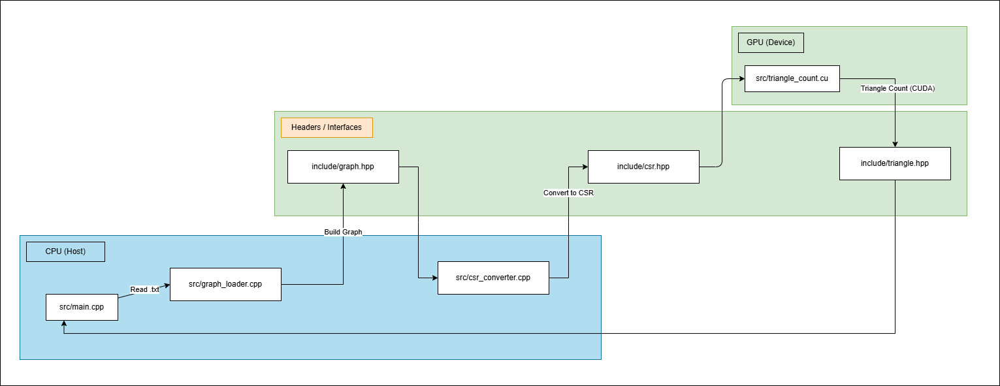

# Triangle Counting in CUDA & C++



## Overview

This repository is my deep dive into GPU-accelerated graph analytics, built entirely form scratch using CUDA and C++. I didn't want to just write a kernel, I wanted to understand the whoe pipeline: from loading in messy data, converting it into a clean CSR layout, and then pushing it through a GPU kernel that can handle millions of edges in parallel. 

Along the way, I used Nsight Systems and Nsight Compute to study how my code actually behaves on the GPU, not in theory, but in real hardware. This project became a hands-on way for me to learn how high-performance GPU systems are designed, debugged, and optimized.

---

### Why this project matters 

I've always been fascinated by how GPUs go through massive workloads, but I realized I didn't truly understand what happens between "write a kernel" and "get fast results." This project turned out to be the perfect challenge for me:

- It's simple to explain
- It forces me to think about memory layout
- It exposes how GPU's behave under irregular workloads
- It rewards careful engineering

Working through this project taught me how much performance comes from everything around the kernel: the data structures, the memory access patterns, the launch configuration, and the profiling tools that reveal what's really happening under the hood.

---

### Highlights

- Custom graph ingestion pipeline
- Clean CSR construction with sorted adjacency lists
- Memory coalesced structure of arrays layout for edges
- Safe CUDA error handing with CUDA_CHECK
- Per-edge parallelism for high GPU throughput
- Full performance analysis using Nsight Systems and Nsight Compute

---

### Project Structure + How to build and run the project

To build the project with full support for profiling and source‑level analysis, compile it using:

```
accelerated_graph_analytics/
├── data/
│   ├── sample_graph.txt
├── include/
│   ├── csr.hpp
│   ├── graph.hpp
│   ├── triangle_count.hpp
├── src/
│   ├── csr_converter.cpp
│   ├── graph_loader.cpp
│   ├── main.cpp
│   └── triangle_count.cu
├── triangle_count.exe

nvcc -O3 -std=c++17 -lineinfo -g -Iinclude ^
  src\triangle_count.cu ^
  src\main.cpp ^
  src\graph_loader.cpp ^
  src\csr_converter.cpp ^
  -o triangle_count.exe
```

---
 
### Architecture

1) Read an edge list file (ordered or unordered)
2) Normalize each edge so that u < v
3) Sort edges by (u, v) to guarantee deterministic adjacency lists
4) Build CSR (row_ptr + col_idx)
5) For each edge (u, v), run a two-pointer intersection on neighbors(u) and neighbors(v)
6) Count all w such that u < v < w
7) Parallelize the entire process on the GPU

---

### Nsight System


---

### Nsight Compute


---

### Helpful References

- https://www.nvidia.com/en-us/glossary/graph-analytics/
- https://www.youtube.com/watch?v=F_BazucyCMw&t=14s
- https://docs.nvidia.com/nsight-compute/NsightCompute/index.html
- https://docs.nvidia.com/nsight-systems/UserGuide/index.html#cuda-trace

